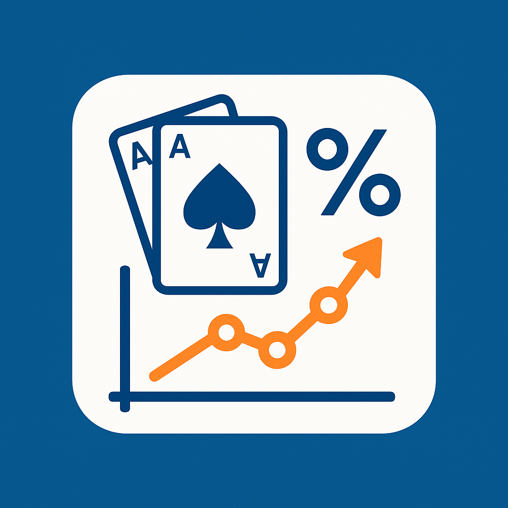

# Poker Odds + EV Calculator & Advice — Free API for Texas Hold’em

The Poker Odds & EV Advisor API is a powerful tool for poker players, app developers, and gaming platforms who need accurate Texas Hold’em odds calculations in real time.  

<p align="center">
  🆓 <b>FREE API</b> — use instantly on 
  <a href="https://rapidapi.com/vintarok-vintarok-default/api/poker-odds-equity-ev-calculator-advice-api" target="_blank"><b>RapidAPI</b></a> 🚀
</p>

<p align="center">
  <a href="https://rapidapi.com/vintarok-vintarok-default/api/poker-odds-equity-ev-calculator-advice-api">
    
  </a>
</p>

Our engine uses Monte Carlo simulations to deliver detailed win and tie probabilities for any number of players and board states. Beyond basic odds, it provides full equity analysis, expected value (EV) breakdowns, and final hand category distributions (pairs, straights, flushes, full houses, and more).  

With integrated break-even call thresholds and maximum profitable call amounts, the API empowers users to make mathematically correct strategic decisions — whether to call, fold, or determine up to which bet size a call remains +EV.  

### Key Features:
- 🚀 Fast Monte Carlo–based simulations for poker odds  
- 🃏 Multi-player win/tie percentages  
- 📊 Equity and expected value (EV) calculations  
- 🧮 Break-even call and maximum profitable call analysis  
- 🗂️ Hand category distribution probabilities  
- ✅ Clear strategic advice: *call*, *fold*, or *indifferent*  

### Why Us?
- 🌍 The most complete poker odds engine on the market – from raw probabilities to advanced EV and strategy guidance  
- ⚡ Unmatched accuracy – Monte Carlo iterations deliver statistically sound results  
- 🚀 Fastest response times – optimized simulation engine for real-time integration  
- 🔒 Reliable & scalable – battle-tested for multiple players and large workloads  
- 🧩 Easy integration – simple REST interface with JSON responses  
- 📈 Professional-grade analysis – break-even call thresholds and +EV decision support no other free tool provides  

Perfect for poker apps, training tools, AI poker bots, strategy analyzers, or simply enhancing user engagement in gaming products.  

Level up your poker app with data-driven insights and professional-grade probability calculations!

---

# Poker Odds + EV Calculator & Advice API | Texas Hold’em Equity & EV Advisor API

Compute win/tie probabilities, equity, expected value (EV), break-even call thresholds, maximum profitable call amounts, and optional final hand category distributions for any number of players and any board state. The engine uses **Monte Carlo simulations** and returns clear advice: `call`, `fold`, or `indifferent` (borderline, EV ≈ 0).

---

## 🎮 Game
Texas Hold’em

## 📤 Output
JSON

## 💡 Typical Uses
- Poker calculators
- Training tools
- HUDs
- Bots
- Strategy analyzers


---

## 📍 Endpoint
```
GET /evaluate.php
```

Returns win/tie percentages for each player. Optional blocks:
- `categories` — final hand category probabilities per player
- `ev` — equity, break-even call, max profitable call, EV diff, and advice (call/fold/indifferent)

---

## 🔎 Query Parameters

### `players` (string, **required**)
- Comma-separated list of player hole cards.
- Each known hand = exactly **2 cards** in compact notation (rank + suit).
- Example: `AcKc`, `QhQs`, `TsTd`
- Unknown hand = empty token `""` between commas.
- Order = seat order. No spaces.
- **Do not repeat physical cards** across players/board.

Examples:
```
players=AcKc,QhQs
players=AcKc,,QhQs
players=,QhQs,,TsTd
players=AcKc,
players=AhKh,7d7c,,QsJh,,9c9d
```

---

### `board` (string, optional)
Community cards (0–5 cards), no spaces.

Examples:
```
board=AdKh2c       # flop
board=AdKh2c7d     # turn
board=AdKh2c7d9s   # river
```

---

### `with_categories` (boolean 0/1, optional)
If `1`, include final hand category distributions (High Card, One Pair, …) for each player.

---

### `with_ev` (boolean 0/1, optional)
If `1` and `pot` is provided, include EV analysis and advice.

---

### `pot` (number, required when `with_ev=1`)
Current pot size (same units as call). Can be `0` but must be present when `with_ev=1`.

---

### `call` (number, optional, default `0`)
Price to call (same units as pot). Used for break-even and max-call math.

---

## 🃏 Card Notation (very explicit)
- **Ranks**: `A,K,Q,J,T,9,8,7,6,5,4,3,2` (`T = Ten`; do not use `10`)
- **Suits**: `c` clubs, `d` diamonds, `h` hearts, `s` spades
- **Known hand**: exactly 4 chars → `AcKc`, `QhQs`, `TsTd`, `7d7c`
- **Unknown hand**: empty token `""` between commas → `,`
- **No spaces** anywhere
- **No duplicates**: the same card cannot appear twice

---

## 📡 Example Requests

### Odds only
```
GET /evaluate.php?players=AcKc,QhQs
```

### With board and EV
```
GET /evaluate.php?players=AcKc,QhQs&board=AdKh2c&with_ev=1&pot=100&call=20
```

### Add category distributions
```
GET /evaluate.php?players=AcKc,QhQs&board=AdKh2c&with_categories=1
```

---

## 📦 Example Responses

### Minimal (odds only)
```json
{
  "win_perc": [63.0, 31.0],
  "tie_perc": [6.0, 6.0],
  "players_count": 2
}
```

### With EV block
```json
{
  "win_perc": [62.5, 31.5],
  "tie_perc": [6.0, 6.0],
  "players_count": 2,
  "ev": {
    "pot": 100.0,
    "call": 20.0,
    "players_count": 2,
    "players": [
      {
        "seat": 1,
        "equity": 0.65,
        "be_call": 0.167,
        "max_call": 185.71,
        "ev_diff": 24.5,
        "decision": "call"
      },
      {
        "seat": 2,
        "equity": 0.35,
        "be_call": 0.167,
        "max_call": 53.85,
        "ev_diff": -11.5,
        "decision": "fold"
      }
    ]
  }
}
```

### With categories
```json
{
  "categories": {
    "stage": "flop",
    "players_count": 2,
    "players": [
      {
        "seat": 1,
        "hand": "AcKc",
        "known": true,
        "categories": {
          "High Card": 12.4,
          "One Pair": 41.1,
          "Two Pair": 7.2,
          "Three of a Kind": 1.0,
          "Straight": 16.9,
          "Flush": 0.0,
          "Full House": 0.0,
          "Four of a Kind": 0.0,
          "Straight Flush": 0.0,
          "Royal Flush": 0.0
        }
      },
      {
        "seat": 2,
        "hand": "QhQs",
        "known": true,
        "categories": { "...": 0.0 }
      }
    ]
  }
}
```

---
## 📍 Endpoint
```
GET /categories.php
```

Returns **only** the final hand **category distributions** per player (High Card, One Pair, …).  
Use this when you don’t need win/tie or EV — it’s faster.  
**Detailed parameter rules are the same as above; see the main docs.**

---

## 🔎 Query Parameters

### `players` (string, **required**)
Comma-separated hole cards by seat, `""` for unknown. No spaces.  
Examples:
```
players=AcKc,QhQs
players=AcKc,,QhQs
```

### `board` (string, optional)  
0–5 community cards, compact notation.  
Examples:
```
board=AdKh2c
board=AdKh2c7d9s
```

---

### ✅ Example
```
GET /categories.php?players=AcKc,QhQs&board=AdKh2c
```

---

## 📍 Endpoint
```
GET /ev.php
```

Returns **only** the EV block for each player: equity, break-even call, max profitable call, EV diff, and advice (`call`/`fold`/`indifferent`).  
Use this when you only need EV — it’s faster than computing the full `/evaluate.php`.  
**Detailed parameter rules are the same as above; see the main docs.**

---

## 🔎 Query Parameters

### `players` (string, **required**)  
Same format as above.

### `board` (string, optional)  
0–5 community cards.

### `pot` (number, **required**)  
Current pot size (same units as `call`). May be `0`, but **must be present**.

### `call` (number, optional, default `0`)  
Cost to call, used for BE% and max-call math.

---

### ✅ Example
```
GET /ev.php?players=AcKc,QhQs&board=AdKh2c&pot=150&call=50
```

&gt; These two endpoints are designed for **performance** when you don’t need the complete `/evaluate.php` output in one request. For full validation rules, card notation, and examples, **see the detailed documentation above**.


---
## 📊 EV & Advice

Definitions:
- **equity** = (win% + 0.5 × tie%) / 100
- **break-even call** `be_call` = call / (pot + call) (fraction)
- **max profitable call** `max_call` = (equity / (1 - equity)) × pot
- **EV diff** = equity × (pot + call) − call

Advice rules:
- `call` → EV diff &gt; tolerance
- `fold` → EV diff &lt; −tolerance
- `indifferent` → |EV diff| ≤ tolerance (borderline; either action is fine)


---

## ✅ Validation Rules (strict)
- `players` must contain at least 1 seat; max 15 seats.
- Each known hand = exactly 4 chars (two different cards).
- `board` length must be 0/2/4/6/8/10 (0–5 cards).
- No duplicate cards across all players and board.
- Only allowed ranks/suits.
- For `with_ev=1`, you must provide `pot` (can be 0). `call` defaults to 0.

---

## ⚠️ Typical 400 Errors
- `players`: invalid card token 'Xy'
- `players`: player 3 must be exactly 4 chars (e.g., AcKc)
- `board`: too many cards (max 5)
- `cards`: duplicate card As … already used …

---

## 📈 Rate Limits & Quotas
Depend on your **RapidAPI plan** (see Pricing). Hitting a quota/limit returns the corresponding proxy error/status.

